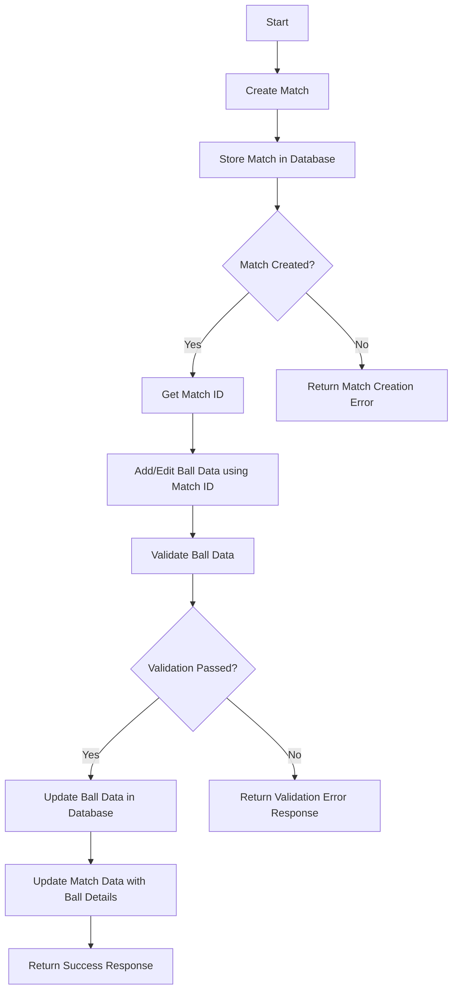

# Cricket Match Data Tracking API

## Overview

The Cricket Match Data Tracking API is designed to track cricket match data with fine-grained detail. It enables accurate ball-by-ball updates and manages match data, including:

- Creating and managing match details.
- Tracking ball-by-ball events (runs, no-balls, wide balls, fours, sixes).
- Maintaining statistics for batsmen and bowlers (runs scored, balls faced, strike rates, runs conceded, no-balls conceded, economy rates).
- Updating and reverting match data to ensure consistency.
- Providing comprehensive match details through a dedicated endpoint.

## Features

- **Match Management:** Create and Fetch match details.
- **Ball Tracking:** Add and update ball-by-ball events.
- **Statistics Management:** Maintain and update individual batsman and bowler statistics.
- **Error Handling:** Robust error handling and data validation using Joi.
- **Documentation:** API documentation generated using apidoc.

## High-Level System Design: Cricket Match Data Tracking

This system is designed to manage and track cricket match data with a focus on ball-by-ball updates. The flow is divided into two main parts: creating a match and adding/editing ball data based on the match ID.

### System Flow




## Installation

1. **Clone the Repository**

   ```bash
   git clone https://github.com/anujsinghwd/cric-stats-api
   cd cric-stats-api
   ```

2. **Install Dependencies**
  Make sure you have Node.js and npm installed. Then, run the following command to install all required dependencies:
   ```bash
   npm install
   ```

3. **Create a .env File**

- **NOTE: for testing purpose added the .env file with credentials**

  Create a .env file in the root directory of your project to configure environment variables. Example:
   ```bash
   PORT=3000
   MONGO_URI=mongodb://localhost:27017
   DB_NAME=cricket-api
   ```
   ## Configuration

   To set up environment variables for the project, create a `.env` file in the root directory of the project. This file will be used to configure settings such as the port number, database connection, and other environment-specific variables.

   ### Example `.env` File

   ```bash
   PORT=3000
   MONGO_URI=mongodb://localhost:27017
   DB_NAME=your_database_name

4. **Setup MongoDB**
  Ensure you have MongoDB running on your local machine or specify the connection string in the .env file.

## Scripts

- **Start the Application**
To start the application, use:
   ```bash
   npm start
   ```
- **Generate API Documentation**
To generate API documentation using apidoc, use:
   ```bash
   npm run apidoc
   ```
This will create the documentation in the apidoc/ directory.

- **Serve API Documentation**
To serve the generated API documentation with the Express app, make sure to include the following line in your app.js or server.js:
   ```bash
   app.use('/docs', express.static(path.join(__dirname, 'apidoc')));
   ```
You can access the documentation at http://localhost:3000/docs.

## API Endpoints

### Create a Match
----------------------------------

**HTTP Method:** `POST`  
**Endpoint:** `/matches`

**Description:**  
Creates a new match and returns the match details.

**Request:**

- **Request Body:**

  ```json
  {}

**Response:**

- **Success Response:**
   ```json
   {
      "success": true,
      "message": "Match created successfully",
      "data": {
         "totalRuns": 0,
         "crr": 0,
         "noBall": 0,
         "wideBall": 0,
         "fours": 0,
         "sixes": 0,
         "totalBallsPlayed": 0,
         "over_str": 0,
         "_id": "MATCH_ID",
         "batsmanStats": [],
         "bowlerStats": [],
         "created_at": "2024-08-13T11:09:33.458Z",
         "updated_at": "2024-08-13T11:09:33.458Z",
         "__v": 0
      }
   }

- **Error Response:**
```json
   {
      "message": "Error message",
      "error": "Detailed error information"
   }
```

- **Status Codes:**
	- **201** Created: Resource created successfully.
	- **400** Bad Request: Invalid request data.

### Fetch a Match
----------------------------------
**HTTP Method:** `GET`  
**Endpoint:** `/matches/:matchId`

**Description:**  
returns the match details.

### Add a Ball
----------------------------------
**HTTP Method:** `POST`  
**Endpoint:** `/balls`

**Description:**  
Adds a new ball entry to the match.

### Ball Data Properties

| Property    | Type     | Description                                                                                   | Example      |
|-------------|----------|-----------------------------------------------------------------------------------------------|--------------|
| `matchId`   | `string` | The unique identifier for the match. It should be a valid MongoDB ObjectId.                    | `60b6a5efc25e4b2d4c8b4567` |
| `runs`      | `number` | The number of runs scored on this ball. It should be a non-negative integer.                   | `1`          |
| `striker`   | `string` | The name of the batsman who faced the ball. This is a required field.                          | `Rohit`      |
| `nonStriker`| `string` | The name of the batsman at the non-striker end. This is a required field.                      | `Virat`      |
| `bowler`    | `string` | The name of the bowler who bowled the ball. This is a required field.                          | `Bumrah`     |
| `noBall`    | `number` | A flag indicating if the ball was a no-ball. It should be either `0` (no) or `1` (yes).        | `0`          |
| `wideBall`  | `number` | A flag indicating if the ball was a wide ball. It should be either `0` (no) or `1` (yes).      | `0`          |
| `over_str`  | `number` | The over number in which the ball was bowled. It should be a positive number.  

**Request:**

- **Request Body:**

  ```json
   {
      "matchId": "MATCH_ID",
      "runs": 1,
      "striker": "Rohit",
      "nonStriker": "Virat",
      "bowler": "Bumrah",
      "noBall": 0,
      "wideBall": 0,
      "over_str": 1
   }

**Response:**

- **Success Response:**
   ```json
   {
      "success": true,
      "message": "Ball added successfully",
      "data": {
         "matchId": "66bb3eed5e92c747450890fa",
         "runs": 1,
         "striker": "Rohit",
         "nonStriker": "Virat",
         "bowler": {
               "key": "Bumrah"
         },
         "noBall": 0,
         "wideBall": 0,
         "over_str": 1,
         "_id": "BALL_ID",
         "created_at": "2024-08-13T11:09:44.585Z",
         "updated_at": "2024-08-13T11:09:44.585Z",
         "__v": 0
      }
   }

- **Error Response:**
```json
   {
      "message": "Error message",
      "error": "Detailed error information"
   }
```

- **Status Codes:**
	- **201** Created: Resource created successfully.
	- **400** Bad Request: Invalid request data.
   - **404** Not Found: Match not found.


### Update a Ball
----------------------------------

**HTTP Method:** `PUT`  
**Endpoint:** `/balls`

**Description:**  
Updates an existing ball entry.

**Request:**

- **Request Body:**

  ```json
   {
      "ballId": "BALL_ID",
      "runs": 6,
      "striker": "Player Name",
      "nonStriker": "Player Name",
      "bowler": "Player Name",
      "noBall": 0,
      "over_str": 1
   }

**Response:**

- **Success Response:**
   ```json
   {
      "message": "Ball updated successfully",
      "data": {
         "ballId": "ballId",
         "matchId": "MatchID",
         "runs": 6,
         "striker": "Player Name",
         "nonStriker": "Player Name",
         "bowler": "Player Name",
         "noBall": 0,
         "over_str": 1,
         "created_at": "timestamp",
         "updated_at": "timestamp"
      }
   }

- **Error Response:**
```json
   {
      "message": "Error message",
      "error": "Detailed error information"
   }
```

- **Status Codes:**
	- **201** Created: Resource created successfully.
	- **400** Bad Request: Invalid request data.
   - **404** Not Found: Match not found.


## Validation

Validation is handled using Joi. The following validation rules are applied:

- **Match Validation:** Ensures that required fields are provided and validates the format of the data.
- **Ball Validation:** Ensures that all required fields are provided and validates the format of the data.

## TODO
- **WideBall** Ensure wideball logic